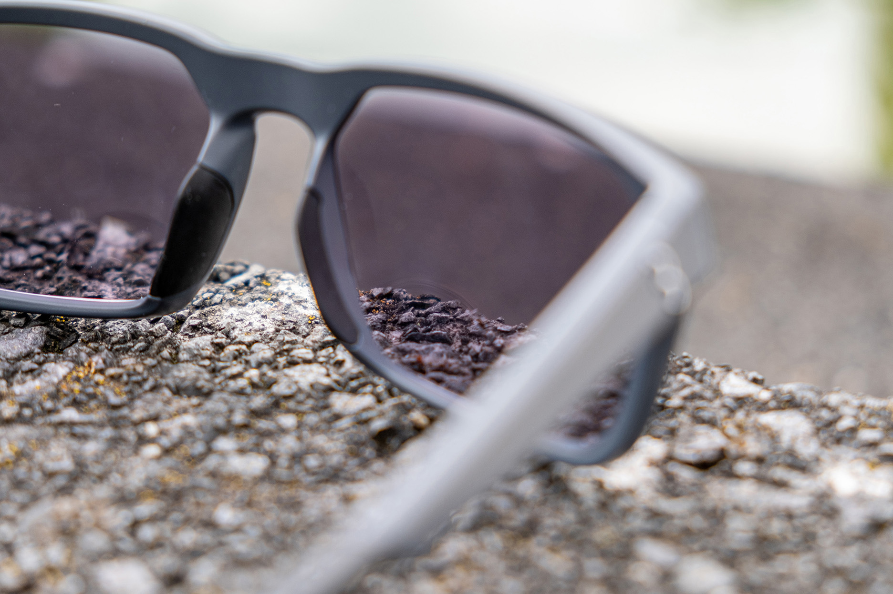

# Layout Guide

* Cells are laid out in left to right, top to bottom order.
* Images do not need to be cropped, they'll adjust to fit the container with no gaps.
* Images should not be larger than 1872px wide - 4K probably unnecessary. Save with jpeg quality 10 in photoshop.
* All images should go in the ```content/grid-images``` folder. This folder can then be uploaded to the same folder on the sever when done. The URLs in your template will not need to be changed on the live server.
* Breakpoints are currently using the browser window size and breaks at 768px. This will likely stay this way until container queries are a proper thing although the breakpoint can be changed.

## Cell

```html
<a class="cell" href="/products">
	
	<div>
		<h1>Clearance Products</h1>
		<h2>Some text about the products</h2>
	</div>
</a>
```

## 1 Column

```
grid-1

+-----+
|     |
+-----+
```

## 2 Column

```
grid-2

+-+-+
| | |
+-+-+
```

```
grid-2a

+-+-+
| | |
| +-+
| | |
+-+-+
```

## 3 Column

```
grid-3

+-+-+-+
| | | |
+-+-+-+
```

```
grid-3a

+---+-+
|   | |
|   +-+
|   | |
+---+-+
```

```
grid-3b

+---+-+
|   | |
+---+-+
|   | |
+---+-+
```

## 4 Column

```
grid-4

+-+-+-+-+
| | | | |
+-+-+-+-+
```

```
grid-4a

+---+-+-+
|   | | |
|   +-+-+
|   | | |
+---+-+-+
```

```
grid-4b

+---+-+-+
|   | | |
+---+-+-+
|   | | |
+---+-+-+
```